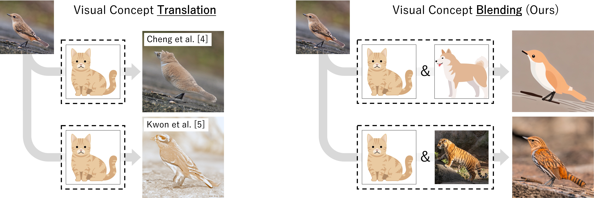

# Zero-Shot Visual Concept Blending Without Text Guidance (Official Implementation)

[](https://arxiv.org/abs/2503.21277)

This repository provides a package for performing operations on image concepts using IP-Adapter's CLIP embeddings and transferring these concepts to other images.
For details, see the arXiv paper.


Figure 1. Conventional visual concept translation vs. the proposed visual concept blending. In conventional methods, it is difficult to distinguish the features that should be transferred because only a single reference image is available. Our proposed method can effectively control the features we wish to transfer (e.g., illustration style or tiger stripes) by performing operations in the projection space of the CLIP embedding vectors and extracting a common concept from multiple reference images. Adapted from [Makino et al., arXiv:2503.21277].


## Preparation
1. Install compatible NVIDIA drivers, CUDA, CuDNN, Python, PyTorch

2. Clone this repository

3. Clone [IP-Adapter](https://github.com/tencent-ailab/IP-Adapter)

4. Copy files from IP-Adapter
```
cp IP-Adapter/ip_adapter/{attention_processor.py,custom_pipelines.py,ip_adapter.py,resampler.py,test_resampler.py,utils.py} Visual-Concept-Blending/vcb
```

5. Download pretrained models
```
cd Visual-Concept-Blending
git lfs install
git clone https://huggingface.co/h94/IP-Adapter
mv IP-Adapter/models models
mv IP-Adapter/sdxl_models sdxl_models
```

6. Clone ZoeDepth (for depth maps)
```
git clone https://github.com/isl-org/ZoeDepth.git
```
(Pretrained models will be automatically downloaded on the first run.)

7. Install the required libraries
```
pip install diffusers==0.22.1 transformers==4.42.4 huggingface-hub==0.23.3 accelerate pandas pytorch-lightning requests urllib3 certifi imutils==0.5.4 timm==0.6.7 einops==0.6.0 opencv-python notebook ipywidgets
```


## Run

### 1. CLI
```
python visual_concept_blending.py -k <key_img> -r <ref_img1> <ref_img2> -o <output_dir>
```
For example, `python visual_concept_blending.py -k bird.png -r cat_art.png dog_art.png -o images -t 0.6 -d 1.0`

#### Required Arguments
- `-k`, `--key_img_path`: Path to the key image. 
- `-r`, `--ref_img_paths`: Paths to two or more reference images (space-separated). 
- `-o`, `--output_dir`: Directory to save result images.  

#### Optional Arguments
- `-t`, `--theta`: [float] Threshold for extracting reference features (default 0.4).    
- `-d`, `--depth_scale`: [float] Strength of shape constraint (default 0.0).  
- `--seed`: [int] Random seed.
- Select
    - `--common`: Use 'common' concept transfer (default enabled).  
    - `--distinctive`: Disable 'common' and use 'distinctive' concept transfer instead.  


### 2. In Jupyter Notebook
```
jupyter notebook
```
and run `visual_concept_blending.ipynb`


## Citation
If this code is useful for your work, please cite our paper:

```
@article{makino2025,
  title={Zero-Shot Visual Concept Blending Without Text Guidance},
  author={Makino, H. and Yamaguchi, T. and Sakai, H.},
  journal={arXiv preprint arXiv:2503.21277},
  year={2025}
}
```


## License
This repository is licensed under `LICENSE.md`.